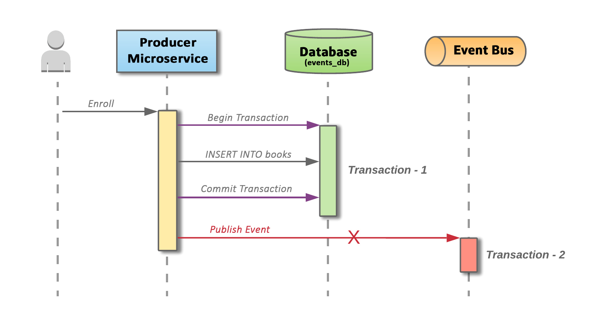
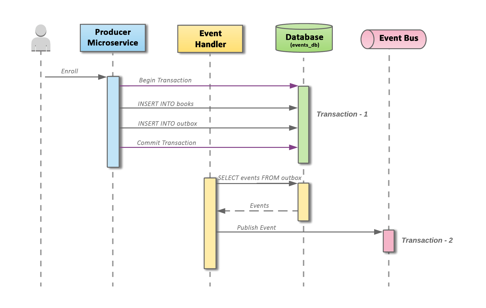
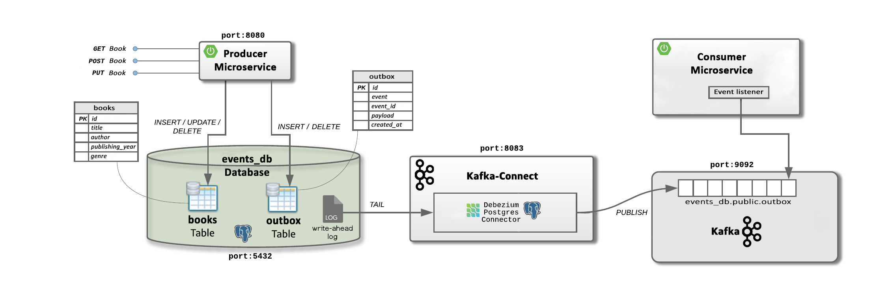

# Transaction outbox pattern
## Description
This project implements the transactional outbox pattern 
for microservices running in a docker or a kubernetes cluster.

## Table of contents

- [The problem statement](#The problem statement)
- [The OutBox pattern](#The OutBox pattern)
- [How to run the project](#How to run the project)
- [How to use](#How to use)

## The problem statement
Microservices often publish events after performing a database transaction. 
Writing to the database and publishing an event are two different transactions 
and they have to be atomic. A failure to publish an event can mean critical
failure to the business process.


<figcaption style="text-align:center;">
 <em>Image 1. Failure while publishing an event after updating/inserting the database.</em>
 <p></p>
</figcaption>

## The OutBox pattern
This pattern provides an effective solution to publish events reliably. 
The idea of this approach is to have an "outbox" table in the service’s database.
When receiving a request for enrollment, not only an insert into the "books" 
table is done, but a record representing the event is also inserted into the "outbox"
table. The two database actions are done as part of the same transaction.
An asynchronous process monitors the "outbox" table for new entries and if there 
are any, it publishes the events to the Event Bus. The pattern merely splits 
the two transactions over different services, increasing reliability.


<figcaption style="text-align:center;">
 <em>Image 2. Two separate transactions using the outbox pattern.</em>
 <p></p>
</figcaption>

## OutBox pattern using Kafka and Debezium
### Solution Design  
The Producer microservice exposes endpoints to perform database operations 
on the domain. The microservice uses a Postgres database, which houses 
two tables "books" and "outbox". The transactional operations,
modify/insert into the "books" table and adds a record in the “outbox” table.
The Debezium connector for Postgres is deployed on the Kafka-Connect runtime,
to capture the changes on the database. The Debezium connector tails the database
transaction logs (write-ahead log) from the "outbox" table and publishes 
an event to the topics defined by the custom connector.


<figcaption style="text-align:center;">
 <em>Image 3. Solution Design</em>
 <p></p>
</figcaption>

## How to run the project
Here will be shown how to run using docker,
to run in kubernetes cluster switch the branch to [kubernetes](https://github.com/viktor-shilay/outbox-pattern/tree/kubernetes).
### 1. Docker
Make sure that you have [Docker](https://www.docker.com/) installed on your machine.
```
# Clone a repo
$ git clone https://github.com/viktor-shilay/outbox-pattern.git
$ cd outbox-pattern

# Build Producer microservice
$ cd producer
$ ./gradlew build -x test

# Build Consumer microservice
$ cd consumer
$ ./gradlew build -x test

# Start up application by running docker compose up.
$ cd outbox-pattern
$ docker-compose up -d
```
### 2. Kubernetes
We will run 2 microservices (`producer` & `consumer`) in k8s cluster and other services in docker on local machine. \
You can use [minikube](https://minikube.sigs.k8s.io/docs/) (or any alternative like [k3s](https://k3s.io/)) to easily create a kubernetes cluster. \
I use Windows-machine and I'll show how to run it in minikube:
1. Install [minikube](https://minikube.sigs.k8s.io/docs/). 
Then start the kubernetes cluster using the command below in cmd: 
   ```
   minikube start
   ```
2. Install [kubectl](https://kubernetes.io/docs/tasks/tools/install-kubectl-windows/), command-line tool that allows you to run commands against Kubernetes cluster.\
Now follow the instructions below:
   ```
   # Run docker compose
   $ docker compose -up -d
   
   # Create the objects that are defined in k8s directories
   $ kubectl apply -f k8s
   $ kubectl apply -f producer/k8s
   $ kubectl apply -f consumer/k8s
   ```
3. To send requests to the `producer` service running in the k8s cluster you'll need create a tunnel to your localhost.
   ```
   minikube tunnel 
   ```
4. To see `consumer` logs use the command below: 
   ```
   kubectl logs -f <pod-name>
   ```
   If you want to control and know all information about your cluster you can use [Lens](https://k8slens.dev).

## How to use
To make requests I use Postman, but you can use curl or smth.
1. Send POST request (http://localhost:8083/connectors) with the content below to activate debezium connector: 
    ```
    {
        "name": "events-connector",
        "config": {
            "connector.class": "io.debezium.connector.postgresql.PostgresConnector",
            "tasks.max": "1",
            "database.hostname": "host.docker.internal",
            "database.port": "5432",
            "database.user": "postgres",
            "database.password": "root",
            "database.dbname": "events_db",
            "database.server.name": "events_db",
            "table.include.list": "public.outbox",
            "database.history.kafka.bootstrap.servers": "kafka:9092",
            "database.history.kafka.topic": "schema_changes.orders",
            "transforms": "unwrap",
            "transforms.unwrap.type": "io.debezium.transforms.ExtractNewRecordState"
        }
    }
    ```
    

    Once you make the request, Kafka will start sending events for every database operation on the table outbox. 
Debezium will keep reading the database logs and send those events to Apache Kafka through Kafka Connector.


2. Now whenever when you create a new book, consumer service will receive notification. 
To create new book, send POST request ("http://localhost:8080/api/v1/books"). Swagger UI is also available at http://localhost:8080/swagger-ui/


3. Read the consumer container logs using the command below: 
    ```
   docker logs consumer -f
    ```
   And you'll see the result:
   
